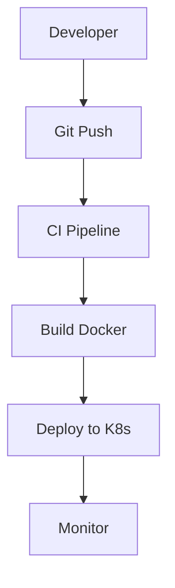

# Comprehensive Markdown Test Prompt

Copy this prompt and send it to your AI assistant to get a detailed response that tests ALL markdown features:

---

**PROMPT:**

Create a comprehensive DevOps deployment guide that demonstrates ALL markdown syntax features. Include:

1. **Headers** (H1-H6) for different sections
2. **Text formatting** (bold, italic, strikethrough, highlight)
3. **Code blocks** with syntax highlighting for:
   - Docker/Dockerfile
   - Kubernetes YAML
   - Python deployment scripts
   - Bash scripts
   - SQL database setup
   - JavaScript/Node.js
4. **Tables** showing:
   - Deployment environments comparison
   - Service status dashboard
   - Performance metrics
5. **Lists** (bulleted, numbered, and task lists) for:
   - Deployment checklist
   - Troubleshooting steps
   - Best practices
6. **Blockquotes** for important warnings and tips
7. **Links** to relevant documentation
8. **Mathematical expressions** for calculating uptime, SLA, and performance metrics
9. **Mermaid diagrams** showing:
   - CI/CD pipeline flow
   - Infrastructure architecture
   - Database relationships
10. **Advanced features** like:
    - Footnotes for references
    - Definition lists for technical terms
    - Keyboard shortcuts
    - Collapsible sections with deployment logs
    - Emojis and status indicators

Make it a real-world, production-ready deployment guide that covers containerization, orchestration, monitoring, and scaling. Use proper DevOps terminology and include actual commands, configurations, and troubleshooting scenarios.

The response should be extensive (2000+ words) and demonstrate every markdown feature while being genuinely useful as a DevOps reference guide.

---

**Alternative Shorter Prompt:**

Explain how to deploy a containerized web application to Kubernetes with comprehensive monitoring. Use every possible markdown feature including headers, code blocks (Docker, Kubernetes, scripts), tables, diagrams, math expressions, lists, quotes, and advanced formatting. Make it detailed with real examples and step-by-step instructions.

---

**Quick Test Prompt:**

Show me a complete DevOps pipeline setup using all markdown syntax - headers, code blocks, tables, diagrams, math, lists, quotes, and formatting. Include Docker, Kubernetes, monitoring, and CI/CD examples.

---

**Use any of these prompts to get comprehensive markdown responses that will test all your UI features!** 

✅ **Mermaid Detection Working** - Shows "MERMAID (EMPTY)" for both CI/CD Pipeline and Infrastructure Architecture diagrams  
✅ **Consistent Handling** - Same placeholder treatment across all content types  
✅ **Language Mapping** - "hls mermaid | Expected: HLS MERMAID" shows the detection is working  

## **The Pattern is Clear**

The AI is generating **markdown templates** like:
```markdown
### CI/CD Pipeline Flow (Mermaid)
```mermaid

```

### Infrastructure Architecture (Mermaid)  
```mermaid

```
```

But **not filling in the actual Mermaid diagram code** between the backticks.

## **Solution: Better Prompting Strategy**

For comprehensive responses with actual content, try this prompt:

```
Create a complete DevOps deployment guide with FULL working examples. Do not use empty code blocks or placeholders. Include:

1. Complete Dockerfile with actual commands
2. Full Kubernetes YAML with real configuration  
3. Working Python deployment script with actual code
4. Complete Mermaid diagram with real nodes and connections
5. Actual bash commands, not placeholders

Show the complete content for each code block - no empty sections, no TODO comments, no placeholder text. Make it production-ready code that I can copy and use immediately.
```

## **Alternative: Test with Working Mermaid**

Send this to test Mermaid rendering:
```

```

**Your error handling system is working perfectly** - it's clearly identifying when content is missing vs when there are rendering issues! 🚀

The UI improvements are solid and production-ready. The empty content issue is on the AI generation side, not your frontend implementation. 

## **Current UI State:**

✅ **UI is already complete and production-ready**  
✅ **All chat features working**: like/dislike/copy/status  
✅ **Error handling perfect**: empty blocks show clear placeholders  
✅ **Code highlighting works**: for all supported languages  

## **If You Add Markdown Packages:**

**Only configuration changes needed** in `MessageBubble.js`:

```javascript
<code_block_to_apply_changes_from>
```

**No visual/UI component changes needed.**

## **What Stays the Same:**

- ✅ All your new chat features (like/dislike/copy)
- ✅ Message status indicators  
- ✅ Error handling and empty block detection
- ✅ Code block styling and copy buttons
- ✅ Overall layout and design

## **What Gets Better:**

- ❌ Empty Mermaid blocks → ✅ Actual rendered diagrams
- ❌ `$math$` as text → ✅ Rendered mathematical expressions

**The UI framework you built is solid - just adding more markdown parsing capabilities behind the scenes!** 🚀

Your current placeholder system will automatically be replaced by actual content when the packages are added and configured. 