# Complete Markdown Syntax Test Suite

Copy this entire message and send it to test ALL markdown features at once:

---

# H1 Heading
## H2 Heading  
### H3 Heading
#### H4 Heading
##### H5 Heading
###### H6 Heading

## Text Formatting
**Bold text** and __also bold__
*Italic text* and _also italic_
***Bold and italic*** and ___also bold and italic___
~~Strikethrough text~~
==Highlighted text==
`Inline code`
Super^script^ and Sub~script~

## Links and Images
[Basic link](https://example.com)
[Link with title](https://example.com "Example Title")
<https://auto-link.com>


## Lists

### Unordered Lists
- Item 1
- Item 2
  - Nested item 2.1
  - Nested item 2.2
    - Deep nested 2.2.1
* Alternative bullet
+ Another alternative

### Ordered Lists
1. First item
2. Second item
   1. Nested numbered 2.1
   2. Nested numbered 2.2
3. Third item

### Task Lists
- [x] Completed task
- [ ] Incomplete task
- [x] ✅ Task with emoji
- [ ] 🚀 Another task with emoji

## Blockquotes
> Single line quote

> Multi-line quote
> that spans several lines
> and continues here

> **Quote with formatting**
> 
> - Quote with list
> - Another item
> 
> ```code
> Quote with code block
> ```

## Code Blocks

### Inline Code
Use `console.log()` for debugging
File path: `/home/user/file.txt`

### Fenced Code Blocks

```javascript
// JavaScript with syntax highlighting
class DevOpsAssistant {
  constructor(name) {
    this.name = name;
  }
  
  async deployApp() {
    try {
      const result = await this.runDeployment();
      console.log(`✅ ${this.name} deployed successfully!`);
      return result;
    } catch (error) {
      console.error(`❌ Deployment failed: ${error.message}`);
      throw error;
    }
  }
}
```

```python
# Python code example
import asyncio
import logging

class DevOpsBot:
    def __init__(self, config):
        self.config = config
        self.logger = logging.getLogger(__name__)
    
    async def monitor_services(self):
        """Monitor all services for health"""
        while True:
            for service in self.config.services:
                status = await self.check_health(service)
                if not status.healthy:
                    await self.alert_team(service, status)
            await asyncio.sleep(30)
```

```yaml
# Docker Compose example
version: '3.8'
services:
  web:
    image: nginx:alpine
    ports:
      - "80:80"
    environment:
      - ENV=production
    volumes:
      - ./html:/usr/share/nginx/html
    depends_on:
      - api
  
  api:
    build: .
    ports:
      - "8000:8000"
    environment:
      - DATABASE_URL=postgresql://user:pass@db:5432/app
```

```bash
#!/bin/bash
# DevOps deployment script
set -e

echo "🚀 Starting deployment..."

# Build and test
npm run build
npm run test

# Deploy to production
docker build -t my-app:latest .
docker push registry.example.com/my-app:latest

# Update Kubernetes
kubectl set image deployment/my-app container=registry.example.com/my-app:latest
kubectl rollout status deployment/my-app

echo "✅ Deployment completed successfully!"
```

```sql
-- Database migration example
CREATE TABLE deployments (
    id SERIAL PRIMARY KEY,
    app_name VARCHAR(255) NOT NULL,
    version VARCHAR(50) NOT NULL,
    status VARCHAR(20) DEFAULT 'pending',
    deployed_at TIMESTAMP DEFAULT CURRENT_TIMESTAMP,
    deployed_by VARCHAR(100) NOT NULL
);

INSERT INTO deployments (app_name, version, deployed_by) 
VALUES ('devops-assistant', 'v1.2.3', 'admin');
```

## Tables

### Basic Table
| Feature | Status | Priority |
|---------|--------|----------|
| Authentication | ✅ Complete | High |
| API Gateway | 🚧 In Progress | High |
| Monitoring | ❌ Pending | Medium |

### Advanced Table with Alignment
| Left Aligned | Center Aligned | Right Aligned | Notes |
|:-------------|:--------------:|--------------:|:------|
| Deploy | 🚀 | 99.9% | Production ready |
| Monitor | 📊 | 95.2% | Real-time metrics |
| Scale | ⚡ | 87.3% | Auto-scaling enabled |

## Mathematical Expressions

Inline math: $E = mc^2$ and $\sum_{i=1}^{n} x_i$

Block math:
$$
\begin{align}
\text{Uptime} &= \frac{\text{Total Time} - \text{Downtime}}{\text{Total Time}} \times 100\% \\
\text{SLA} &= 99.9\% \\
\text{Max Downtime} &= 8.76 \text{ hours/year}
\end{align}
$$

## Diagrams

### Mermaid Flowchart

```mermaid
graph TD
    A[Developer Push] --> B{CI/CD Pipeline}
    B -->|Tests Pass| C[Build Docker Image]
    B -->|Tests Fail| D[❌ Notify Developer]
    C --> E[Push to Registry]
    E --> F[Deploy to Staging]
    F --> G{Manual Approval}
    G -->|Approved| H[Deploy to Production]
    G -->|Rejected| I[❌ Rollback]
    H --> J[✅ Monitor Deployment]
```


### Mermaid Sequence Diagram


## Special Elements

### Admonitions/Callouts
> [!NOTE]
> This is important information that users should notice.

> [!TIP]
> This is a helpful tip for better performance.

> [!WARNING]
> This is a warning about potential issues.

> [!IMPORTANT]
> This is critical information for security.

> [!CAUTION]
> This could cause system damage if not handled properly.

### Keyboard Shortcuts
- Copy: <kbd>Ctrl</kbd> + <kbd>C</kbd>
- Paste: <kbd>Ctrl</kbd> + <kbd>V</kbd>
- Deploy: <kbd>Ctrl</kbd> + <kbd>Shift</kbd> + <kbd>D</kbd>

### HTML Elements
<details>
<summary>🔍 Click to expand deployment logs</summary>

```
2024-01-15 10:30:00 INFO  Starting deployment process
2024-01-15 10:30:01 INFO  Pulling latest image: registry.example.com/app:v1.2.3
2024-01-15 10:30:15 INFO  Image pulled successfully
2024-01-15 10:30:16 INFO  Stopping old containers
2024-01-15 10:30:20 INFO  Starting new containers
2024-01-15 10:30:25 INFO  Health check passed
2024-01-15 10:30:26 INFO  ✅ Deployment completed successfully
```

</details>

### Emojis and Unicode
🚀 Deployment • 📊 Monitoring • ⚡ Performance • 🔒 Security • 🐛 Debug • ✅ Success • ❌ Error • 🚧 In Progress

## Footnotes and References
DevOps practices[^1] require continuous integration[^2] and deployment automation[^3].

The monitoring system provides real-time metrics[^4] for better observability.

## Definition Lists
CI/CD
: Continuous Integration and Continuous Deployment - automated software delivery pipeline

Kubernetes
: Container orchestration platform for automating deployment, scaling, and management

Infrastructure as Code
: Managing and provisioning infrastructure through machine-readable definition files

SRE
: Site Reliability Engineering - discipline that incorporates aspects of software engineering

## Complex Nested Elements

1. **Phase 1: Planning**
   - [ ] Requirements gathering
   - [ ] Architecture design
   - [x] Technology selection
   
   ```yaml
   # Configuration example
   phase: planning
   duration: 2_weeks
   team_size: 5
   ```

2. **Phase 2: Implementation**
   > **Important**: All code must pass security scans
   
   - [x] Backend API development
   - [x] Frontend implementation  
   - [ ] Integration testing
   
   | Component | Status | Coverage |
   |-----------|--------|----------|
   | API | ✅ | 95% |
   | Frontend | ✅ | 87% |
   | Tests | 🚧 | 73% |

3. **Phase 3: Deployment**
   
   ```mermaid
   gitGraph
       commit id: "Initial"
       branch develop
       commit id: "Feature A"
       commit id: "Feature B"
       checkout main
       merge develop
       commit id: "Release v1.0"
   ```

---

**Test Instructions:**
1. Copy this entire message
2. Send to your AI assistant
3. Test all UI features:
   - 📋 Copy button functionality
   - 👍👎 Like/dislike buttons
   - 📊 Message status indicators
   - 🔄 Real-time rendering

This tests every major markdown feature in one comprehensive message!

[^1]: DevOps combines development and operations teams
[^2]: CI ensures code changes are automatically tested
[^3]: CD automates the release process
[^4]: Real-time metrics provide immediate feedback on system health 